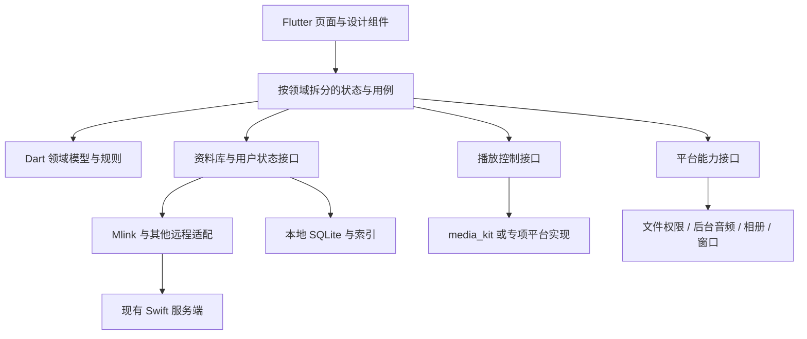

# 映栖 ReelNest：Flutter 跨平台重构实施计划

日期：2026-10-02
参考源码基线：旧 MediaLib `64f8ee2`；旧产品 `1.8.0` / build `98`；数据库 schema `30`；Mlink API `v1`。
状态：实现前规划。品牌确定为“映栖 ReelNest”；当前建立独立本地仓库，尚未创建远程仓库、Flutter 应用或执行跨端构建。

本文提及的 `Sources/`、`Tests/`、`asset/` 等旧源码路径均相对于 [MediaLib 参考提交](https://github.com/829304/MediaLib/tree/64f8ee258d87389414d5e06740a89f59cd857612)，不是 ReelNest 当前已包含的文件。

## 1. 目标与已确认约束

目标是支持 Windows、macOS、iOS、Android、Ubuntu 的媒体库客户端，保留原 macOS 应用的视觉风格和主要交互，允许重写界面代码。

采用 Flutter；优先复用现有接口、领域规则、设计资源和测试样例。SwiftUI 源码作为参考，不能直接作为五端界面代码编译。

默认实施假设：先保留现有 macOS 服务端；先打通远程媒体客户端，再补齐本地媒体库；三种桌面平台支持完整本地库，移动端优先远程库、离线内容和用户授权的本地导入。完整服务器跨平台部署、移动端全量管理能力、商店发布渠道在对应阶段再明确。这些是排期假设，不是删除需求。

ReelNest 五端采用同一个新仓库，未来远程目标为 `829304/reelnest`，当前仅初始化本地仓库。旧 MediaLib 保留在原仓库，作为实现参考和兼容服务端来源；不将旧工程整体复制到新项目。详细目录和 CI 见 [仓库规划](GITHUB_REPOSITORY_PLAN.zh-CN.md)。

## 2. 能否参考现有实现降低难度

可以，主要降低需求探索、业务规则设计、协议设计和边界用例发现的成本。现有系统可以作为行为对照，也能给新客户端提供真实服务端。

但这不是仅重画界面的工作。现有桌面很多逻辑直接调用 Swift 仓储、扫描器和系统框架，没有对应远程 API；这些部分需要迁移实现。五端播放、后台行为、文件权限和视觉还原仍需要实际开发与设备验证。

| 内容 | 复用方式 | 预计帮助 |
|---|---|---|
| 已公开的 HTTP API | Dart 客户端调用现有服务；补齐契约测试 | 对远程浏览、登录、状态同步帮助大 |
| Swift 模型与 DTO | 明确字段语义、默认值、编码、可选字段和版本关系 | 避免重新猜测数据结构 |
| 分类、队列、命名解析等纯规则 | 按行为移植到 Dart，共享输入输出测试样例 | 降低规则偏差与遗漏 |
| UI 和设计参数 | 提取颜色、尺寸、资源、动画与页面状态 | 降低重新设计成本，仍需 Flutter 实现 |
| SQLite schema 与迁移 | 参考领域与历史数据，另做迁移方案 | 不能直接让两套程序共同修改旧库 |
| libmpv/AVFoundation 控制代码 | 参考播放语义，通过新引擎适配 | 底层调用不能直接搬到 Dart |
| XCTest 与验收脚本 | 保留旧测试；迁移行为用例，复用合成样本 | 测试代码不等于可以原样跨语言运行 |

现阶段不承诺节省百分之多少。先完成一条真实的“登录→浏览→详情→播放→进度回传”流程，才能以实际完成量估算后续工作。

## 3. 已核对的接口与缺口

现有原生入口是 `Sources/MediaLib/App/MlinkAPIClient.swift`，公开 DTO 主要在 `Sources/MediaLibServerProtocol/`，路由和授权在 `Sources/MediaLibServer/`。

### 3.1 可直接作为协议基线的接口

| 能力 | 已观察到的路由 | 迁移安排 |
|---|---|---|
| 服务探测 | `GET /.well-known/mlink`、`GET /health` | 校验 API 版本和 capabilities |
| 登录、刷新 | `POST /api/v1/auth/login`、`POST /api/v1/auth/refresh` | 沿用 `delivery: token`，校验响应与刷新机制 |
| 分类、概览 | `GET /api/v1/library/categories`、`GET /api/v1/library/summary` | 原生首页与分类基础 |
| 浏览、搜索、筛选 | `GET /api/v1/library/browse`、`GET /api/v1/library/facets` | 复用分页、排序、搜索及筛选语义 |
| 单项详情 | `GET /api/v1/items/{id}` | 将 DTO 映射为界面模型 |
| 收藏、想看、评分 | `POST /api/v1/user-media/preferences/{id}` | 参考原生客户端已有实现 |
| 播放状态 | `POST /api/v1/playback/state/{id}` | 迁移事件、时间单位与已看规则 |
| 队列 | `GET/POST /api/v1/queue` | 读写分别验证；存在路由不代表原生写入已打通 |
| 播放信息和轨道 | `GET /api/v1/playback/info/{id}`、`.../tracks/{id}`、`.../subtitles/{id}` | 验证原生播放器使用的数据与鉴权 |
| 原始媒体、下载 | `GET /api/v1/stream/{id}`、`GET /api/v1/download/{id}` | 验证 Bearer、Range、跳转与取消 |
| 集合、歌单、人物等 | `ServerDiscoveryHTTPHandler` 中的相关路由 | 按页面逐项核对 DTO 与分页覆盖 |

这是一份已核对源码的摘要，不是完整 OpenAPI。阶段 P0 需从路由、DTO、测试整理出权威契约；不能根据 URL 命名猜测未验证的参数或返回结构。

### 3.2 三个重要边界

**Mlink 现有原生客户端没有完整原生播放闭环。** `MlinkLibrarySynchronizer` 将目录投影为本地索引，注释和实现明确避免构造媒体 URL；播放依赖浏览器自己的会话。Flutter 要内置播放，需要验证服务端媒体接口并实现鉴权、播放准备、进度回传和生命周期处理。

**原生变更请求不是所有 API 都通用。** `HTTPRequestSecurityPolicy.isNativeMlinkMutationPath` 当前仅列出播放状态与媒体偏好两类路径。登录、刷新有自己的处理；队列写入、播放会话、账号设置、管理 API 不应假定只附加 Bearer 就可使用。需要端到端验证，必要时增加明确的原生端点支持及测试，而不是关闭浏览器 CSRF 保护或放宽整个路径前缀。

**本地管理能力不能通过远程浏览 API 替代。** 文件夹选择、文件事件监听、本地扫描、标签读写、系统照片和本机隐私解锁属于平台/本地领域。部分管理与维护 API 已存在，但不能据此推断完整桌面功能都有远程等价物。

此外，桌面首页推荐和保险库解锁存在文件快照形式的宿主联系。客户端脱离旧桌面运行、服务端未来独立部署时，必须明确这些能力由谁持有，不能假定网页呈现逻辑就是可直接调用的 API。

### 3.3 新 API 客户端规则

- 使用独立 Dart DTO，与领域模型、数据库行、UI 状态分离；服务器 ID 作为不透明标识处理。
- 复用现有 `X-MediaLIB-Client: mlink-native/1`、Bearer 和 token 登录语义；不把 token 拼入 URL，不依赖浏览器 Cookie。
- 明确日期编码、秒/毫秒、空值、未知枚举、分页上限、错误码及可重试条件。
- 读取采用有界分页；搜索取消旧请求；令牌刷新合并并发请求，避免刷新风暴。
- 对媒体重定向、字幕、图片、HLS 分片逐一验证认证；跨主机不能盲目转发原服务 token。
- 播放库请求和 Dart HTTP 请求可能使用不同网络实现；TLS 信任、请求头和代理不能假定自动共享。
- 延续非回环 HTTPS 要求，明确本地 CA 的信任流程，测试中不靠关闭证书校验证明成功。
- 已有请求不具备幂等保障时，不能盲目重放播放事件和变更操作；离线队列需设计冲突与重试语义。
- 接口缺口先记录为协议扩展，再实现兼容适配；不通过抓取网页 HTML 代替正式数据契约。

## 4. 推荐实现架构

| 层 | 技术/职责 |
|---|---|
| 界面 | Flutter 自定义组件，复刻原有视觉，桌面与移动布局适配 |
| 状态与依赖 | Riverpod，按资料库、播放、下载、账户等领域拆分 |
| 领域逻辑 | 纯 Dart，尽量不依赖 Widget 和平台对象 |
| 远程数据 | Mlink API 适配；后续 Emby/Jellyfin/Plex 独立适配 |
| 本地数据 | SQLite + Drift，独立迁移与仓储，后台处理阻塞工作 |
| 播放 | `media_kit` 优先原型验证，通过自有接口隔离 |
| 平台能力 | 文件访问、后台媒体、相册、凭据、窗口等独立接口与原生插件 |

Flutter、Drift 和 media_kit 的官方文档均列出了相应跨端支持，但具体插件版本、系统最低版本、CPU 架构和媒体能力需共同验证，不能只看 Flutter 支持表。[Flutter](https://docs.flutter.dev/reference/supported-platforms) · [Drift](https://drift.simonbinder.eu/platforms/) · [media_kit](https://github.com/media-kit/media-kit) · [Riverpod](https://riverpod.dev/docs/concepts2/providers)

边界约束：

- UI 不直接执行 SQL、HTTP 或 mpv 命令；新架构不逐行复制原 `AppState`。
- 远程资料库与本地资料库使用共同的查询意图，但按 capabilities 暴露差异，不伪装不具备的写能力。
- 播放会话持有队列、当前媒体和生命周期；高频进度只刷新需要的组件，避免整页重建。
- 平台层返回可解释的能力与权限状态；Windows 不能假装具有 PhotoKit，手机不能假装具有桌面目录访问。
- 长扫描、解析和数据库任务可取消、可恢复，旧请求结果不能覆盖新请求。
- 初期不强制引入 Rust；出现明确的性能或跨进程共享需求后再以小模块验证，不同时维护两份同一业务规则。

## 5. 保留现有前端的执行方法

先建立设计基线，再开始大规模页面实现。

设计参考包括 `DesignSystemTokens.swift`、`AppColors.swift`、`AppTheme.swift`、`AppSurfaceStyles.swift`、音乐主题相关文件和 `asset/` 中的截图。静态截图用于初始参考；在可用 macOS 环境录制滚动、展开/收起、悬停、键盘和播放器切换，补全交互基线。

| 页面/系统 | 必须保留 | 允许的平台适配 |
|---|---|---|
| 首页、侧栏 | 色彩、信息层级、卡片比例、入口关系 | 手机改为底部导航或抽屉 |
| 海报墙、详情页 | 海报尺寸关系、内容顺序、操作语义 | 列数、触控尺寸、横竖屏布局 |
| 音乐播放器 | 两种主题的核心视觉、歌词与队列交互 | 性能分级、手势、系统媒体控制 |
| 视频播放器 | 播放语义、字幕/音轨、进度、快捷操作 | 桌面快捷键与手机手势分别实现 |
| 系统窗口 | 原版整体气质 | 原生标题栏、材质、全屏行为按平台实现 |

建立明暗主题、空态、加载、错误、离线、大字号和窄窗口的基线。设计参数先迁移为 tokens；组件通过后再组合页面。特定系统图标和字体需使用可随包分发的资源或确定替代品，不能假定 Apple 系统资源在其他平台存在。

视觉验收使用固定数据、尺寸、缩放和时间点的截图；按平台维护合理基线，文字抗锯齿差异不采用零容差。动态效果另做录屏与帧时间分析。macOS 透出桌面的窗口材质与应用内部模糊分开验收，不承诺五端逐像素一致。

## 6. 平台范围与发布层级

| 能力 | Windows / macOS / Ubuntu | iOS / Android |
|---|---|---|
| 远程库浏览、搜索、播放、用户状态 | 首版核心 | 首版核心 |
| 下载和离线播放 | 后续 Beta 阶段 | 后续 Beta 阶段，遵守系统后台能力 |
| 完整本地目录库、扫描与监听 | 本地库阶段 | 先做授权导入，扩展范围单列需求 |
| 系统媒体按键、通知、锁屏控制 | 按系统能力支持 | 核心适配，真机验证 |
| 系统照片 | macOS 使用平台适配；其他端用本地导入或对应接口 | iOS/Android 各自相册权限适配 |
| 长期运行的家庭服务器 | 独立后续里程碑 | 默认不作为后台服务器宿主 |

远程客户端 Alpha、本地库 Beta、完整功能迁移是不同交付级别。Alpha 不等于原应用全功能替代。每个版本都发布能力清单，暂未实现的功能不得显示为可用。

## 7. 阶段与验收

### P0：基线、契约与仓库基础

交付：页面/功能清单、API 契约与脱敏 fixture、原版视觉基线、平台能力清单、Flutter SDK 与依赖候选、仓库骨架规划。

任务：盘点全部旧入口，给每项功能标记“远程复用 / Dart 移植 / 平台适配 / 协议缺口”；建立目标系统、CPU、参考设备和安装渠道矩阵；确定客户端独立应用标识与数据目录。

验收：每个首版功能能追溯到旧实现与测试，API 字段和认证路径有依据，未确认事项明确记录。完成仓库规划 R1/R2 后才启用对应合并门槛。

### P1：最小可运行流程与选型验证

交付：首页海报墙、一个详情页、一种音乐主题、视频播放页、API 客户端与播放器适配原型。

任务：真实登录→分类/分页→详情→播放→收藏/进度回传；验证本地媒体与 HTTPS 媒体；五端均编译并启动，iOS/Android 至少有真机播放与后台音频记录。最初实现可以从 Windows 开始，但不能把 Apple/Linux 可行性留到末期。

验收：同一套测试媒体可复现；播放器失败能区分接口、证书、容器、解码与渲染；macOS 原版与 Flutter 视觉有对照；形成播放器采用/调整决定。未通过的设备能力不能靠模拟数据宣称通过。

### P2：远程客户端 Alpha

交付：登录与会话、首页、资料库、搜索、影视详情、系列/剧集、基础音乐队列、设置、核心播放控制、收藏与播放记录。

任务：完善加载/空态/错误/权限界面；实现分页、图片缓存、状态隔离；补齐 P1 发现的必要服务端契约缺口。远程队列写入若需协议扩展，与本地播放队列分别实现和验收。

验收：五端能使用受授权资料库完成核心流程，登出和切换账号不会串数据；发布标注为远程客户端 Alpha 的产物。

### P3：桌面本地库与历史数据迁移

交付：本地源、扫描、元数据/NFO 读取、缩略图、分类、增量更新、健康检查、可恢复后台任务、历史数据导入工具。

任务：迁移文件名解析、层级归并、队列等纯规则；分别适配 Windows 路径、挂载目录、大小写与 Unicode；区分源离线和文件已删除，避免错误清理。原版默认不修改媒体文件的原则继续保留。

验收：Windows/macOS/Ubuntu 断网可管理并播放本地库；新增、修改、移除与源离线样例通过；与旧版对比分类和播放记录；导入失败可回滚，新版不覆盖旧版数据库。

### P4：移动适配、离线与第二音乐主题

交付：手机/平板布局、第二种音乐主题、完整歌词交互、离线下载、授权文件导入、平台媒体控制。

任务：处理后台/前台、来电或音频中断、耳机拔出、音频焦点、锁屏、进程被终止、权限撤销和网络切换。下载任务持久化，恢复策略按平台能力实现，不承诺无限后台执行。

验收：真实设备连续播放、下载恢复和长列表滚动；下载内容和账户归属明确；设备旋转/窗口变化不丢播放会话。形成跨端客户端 Beta。

### P5：完整功能迁移与候选版

交付：按功能清单补齐 Emby/Jellyfin/Plex、TMDB/音乐元数据、集合/智能歌单、照片、保险库、字幕搜索、标签编辑、第三方记录同步等。

任务：按使用优先级逐项迁移，不把所有外围功能塞入 Alpha；元数据写回继续要求用户显式启用，默认只改应用索引；平台不支持的能力提供清楚的状态。检查旧功能完整性和平台例外表。

验收：目标功能都有“已实现并验证 / 明确不适用 / 待交付”的状态和依据；关键旧行为测试已移植；对外声明与能力清单一致。

### P6：发行与升级

交付：五端安装/分发产物、签名、升级与回滚说明、构建信息、发布渠道、已知限制。

验收：干净机器/设备安装、升级、数据保留、卸载行为符合预期；旧版和新版可在过渡期共存；发行包实际加载随包媒体运行库；正式签名和商店分发不以编译成功代替。

### P7：独立跨平台服务器（条件性阶段）

触发条件：明确要求在 Windows/Ubuntu/NAS 独立托管 MediaLib 服务，而不仅是运行 Flutter 客户端。

先审计现有 Swift 服务端及 Core 的平台依赖和宿主耦合，验证可移植范围，再比较继续移植 Swift 与改写服务端的成本。服务端技术栈尚未定案；不能因为有部分 Linux 条件编译就宣称服务器已支持 Linux。

交付与验收单独定义：无桌面宿主运行、扫描和维护、用户授权、流媒体、升级备份、跨平台部署，以及与旧/新客户端的 API 兼容。

阶段依赖：P0→P1→P2；P3、P4 以 P2 为基础按实际资源安排；P5→P6。P7 独立评估。这里的任务可拆分不意味着已安排多人或子代理执行。

## 8. 数据、缓存与兼容

1. 新客户端使用独立应用标识与数据目录，迁移期间不与旧应用同时写同一 SQLite 文件。
2. 旧数据库 schema 30 是导入来源，不直接成为新库版本号。导入从一致性备份/SQLite 正确快照读取，不能只复制仍在 WAL 写入的主数据库文件。
3. 建立旧 ID→新 ID 映射，验证媒体数、收藏、歌单顺序、播放位置和集合关系；路径需重新定位，不能把 macOS 绝对路径原样当 Windows 路径。
4. 导入采用事务、校验报告、可重入策略和失败回滚；远程凭据在无法安全迁移时重新登录。
5. 远程缓存以 server ID、用户 ID、媒体 ID 分区；登出或授权撤销清理相关数据，保险库锁定时同时处理可见索引和预览缓存。
6. 服务端用户状态作为远程账户权威数据，本地播放队列和未同步事件显式分开；离线更新冲突在支持写回前定义，不用客户端时间戳直接覆盖所有状态。
7. 当前接口缺乏增量同步或并发版本控制时，先用有界刷新和明确的重试策略；需要新增游标、版本条件或幂等键时作为协议扩展，不声称现有接口已支持。

## 9. 验证方案与质量门槛

| 层次 | 测试内容 | 成功证据 |
|---|---|---|
| 领域规则 | 文件名、分类、剧集层级、队列、seek、已看阈值 | Dart 与旧行为共享的输入输出样例 |
| API 契约 | 字段、空值、日期、权限、分页、错误、原生认证路径 | fixture 测试 + 真实旧服务端集成 |
| UI | 页面状态、主题、布局、键盘/触控、缩放 | 组件测试 + 视觉对照 + 交互录屏 |
| 播放 | 本地/远程、字幕/音轨、seek、中断、后台 | 五端具体设备、媒体参数、实际结果 |
| 存储 | 迁移、重复导入、失败回滚、缓存隔离 | 临时库测试与数据核对报告 |
| 发布 | 安装、动态库、签名、升级、数据目录 | 干净系统/设备的可复现验证 |

媒体矩阵至少覆盖 MP4/H.264/AAC、MKV/HEVC、多音轨、ASS/SRT、外置字幕、FLAC/MP3、长音频、4K/HDR 专项样本、HTTPS Range、弱网/断网。HDR 与特殊编码的验收按设备能力声明，不能强行要求所有设备相同。

性能样本建议包含 1 万/5 万条索引、连续滚动海报墙、连续 30 分钟播放与多次切歌。P1 固定参考设备和测量方法后，才锁定首屏、帧时间、内存与耗电预算；不在未测量前承诺统一毫秒数或内存上限。

沿用旧项目中有价值的行为测试和样本。只检查 Swift 源码字符串或文件归属的测试不逐条照搬到 Dart，改为适合新架构的依赖检查或行为测试。

## 10. 首批可执行任务

| 编号 | 任务 | 完成条件 |
|---|---|---|
| F01 | 固化仓库目录与应用标识 | 新旧应用共存方案明确 |
| F02 | 五端 Flutter 骨架与 CI | 同一提交有各端构建结果 |
| F03 | 现有 Mlink 契约清单 | 路由/认证/DTO/样例与源码对应 |
| F04 | 设计参数与基础组件 | 首页和播放器组件有原版对照 |
| F05 | API 登录、分类、浏览 | 真实服务端登录和分页成功 |
| F06 | 播放引擎验证 | 本地、HTTPS 媒体及字幕在目标设备验证 |
| F07 | 详情→播放→状态回传 | 可以重复演示的完整流程 |
| F08 | 原生 API 缺口处理 | 新旧客户端兼容，新增路径测试通过 |
| F09 | P1 评估与后续排期 | 有实测问题清单、工作量依据和更新计划 |

F01–F09 是执行顺序建议，不表示已经开始实现。下一轮先完成 F01/F02/F03，不立即搬迁旧目录或大面积改写原工程。

## 11. 排期方式与待定事项

先以阶段交付和验收门槛控制进度。当前尚无开发人数、可用设备、平台最低版本和完整功能优先级，不给虚假的确定工期。P1 后根据实际界面实现、协议缺口和平台问题，分别估算“远程 Alpha”“本地 Beta”“全功能候选版”“独立服务器”，并保留平台验证缓冲。

进入对应阶段前需决定：

- 旧 macOS 支持范围是否包含 Intel，新各端最低系统版本与目标架构。
- 移动端是完整本地媒体管理器，还是以远程/离线播放为主。
- Windows/Ubuntu 是否必须独立托管家庭服务器，以及是否进入首版范围。
- 首版音乐主题顺序、照片/保险库/标签写入等功能优先级。
- macOS/iOS 构建环境、各平台真机、签名与商店账号是否可用。
- 新客户端公开版本与发行渠道，以及旧版停止维护的条件；产品名称已确定为“映栖 ReelNest”。

这些问题不阻塞当前文档和契约梳理，但会影响功能排期和发行承诺。当前默认沿用“ReelNest 五端同仓库、先客户端、旧 MediaLib 独立保留、早期验证五端”的方案。
