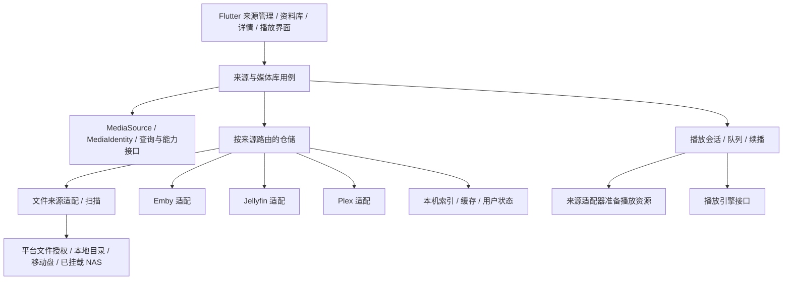

# 映栖 ReelNest：Flutter 跨平台重构实施计划

更新：2026-10-05。本文纠正此前“保留 MediaLib 服务端、先做 Mlink 客户端”的错误假设，替代原阶段安排。
用户最新边界：只做原项目的 Flutter 重构，第一阶段 Windows/macOS/Linux，功能、UI 与交互一致，不自行增删改功能。[项目边界](PROJECT_SCOPE.zh-CN.md) 优先于此前阶段假设。
参考源码基线：MediaLib `64f8ee2`。旧源码路径相对于 MediaLib 仓库。
状态：2026-10-05 已完成第一轮目录来源、SQLite 索引、扫描与浏览，正常应用不再依赖 Mlink 会话；播放器、其他平台授权及三个服务器连接器仍待实现，见 [本地媒体源与索引](LOCAL_SOURCES.zh-CN.md)。下文为完整目标与纠偏任务基线。

## 1. 产品目标与范围

ReelNest 是 MediaLib 的 Flutter 多平台重构版，第一阶段仅 Windows、macOS、Linux 三桌面端。功能、默认规则、UI 和交互与原项目一致，只改变实现技术与平台适配；iOS/Android 后续再做。每个模块都要完成原源码行为和 UI 对照，最终阶段仅做整体一致性验收。

必须覆盖的媒体来源：

| 用户使用的来源 | 接入与职责 |
|---|---|
| 本地文件夹 | 应用直接取得访问权限、扫描、建立索引、读取媒体 |
| 移动硬盘 | 按文件来源接入，记录离线/重新挂载状态，保留索引与播放记录 |
| 已挂载 NAS | 通过系统已提供的路径或授权文件入口读取，处理不可达、只读与恢复 |
| Emby | ReelNest 直接连接 Emby，独立处理认证、目录、播放和状态同步 |
| Jellyfin | ReelNest 直接连接 Jellyfin，按其协议与能力适配 |
| Plex | ReelNest 直接连接 Plex，独立处理认证、库、媒体地址和状态同步 |
| ReelNest Server | 原项目自有服务端及 Mlink 连接能力的重构目标，使用新项目品牌，作为可选来源迁移 |

前三类可以共享文件来源实现，但保留挂载、权限和可用性差异；不需要强行为它们编写三套扫描器。已挂载 NAS 不等于本阶段还要实现 SMB/NFS 挂载客户端。

MediaLib 是功能、业务规则和界面的参考工程，不是所有来源必须经过的后台。原版自身包含的可选服务、连接与共享能力按原功能清单核对迁移；自有服务端统一命名为 ReelNest Server，保留原功能边界，不以品牌调整扩展产品功能。

Mlink 不能作为整个应用的强制前提；原版已有的可选 Mlink 连接行为仍应列入一致性清单。当前仅保留试验代码的状态不构成永久删除该功能的决定。来源表不是允许排除其他原有功能的封闭清单。

## 2. 复用旧源码的方法

参考旧实现能减少业务摸索和边界遗漏，不能把 Swift 代码直接编译为 Flutter，也不能用调用旧应用 HTTP API 代替迁移业务。

| 原版源码入口 | 重构用途 |
|---|---|
| `Sources/MediaLibCore/Models/MediaSource.swift` | 来源配置、扫描选项、元数据策略、可用性模型 |
| `Sources/MediaLibCore/Database/SourceRepository.swift` | 来源持久化与查询行为 |
| `Sources/MediaLibCore/Services/MediaScanner.swift` | 文件遍历、过滤、增量扫描及取消边界 |
| `Sources/MediaLib/Views/SourcesView.swift` | 来源管理、连接/断开分组、扫描进度与操作 |
| `Sources/MediaLibCore/Models/RemoteSyncModels.swift` | 多种远程连接器与同步语义；Mlink 只是其中一种 |
| `Sources/MediaLib/App/EmbyService.swift` | Emby/Jellyfin 现有请求与映射行为，逐项核对差异 |
| `Sources/MediaLib/App/PlexService.swift` | Plex 连接、媒体浏览与播放准备 |
| 原版 View、Core 规则与相关测试 | 翻译页面状态、命名解析、分类、队列、续播与测试样例 |

实施每项功能前追踪旧代码调用链与行为测试。第三方协议用旧实现作为起点，并结合对应官方契约和实际服务器版本验证；不假定 Mlink 的登录、分页、ID 和媒体字段可直接用于其他协议。

## 3. 目标架构

- UI 和领域对象不依赖任何特定服务器 DTO，也不要求全局先登录。
- 每个来源有稳定 `sourceId`。媒体身份至少包含来源与来源内 ID；远程缓存再按连接和账号隔离，防止不同库相同 ID 串数据。
- 文件来源以访问授权和稳定相对标识管理媒体，不以某次盘符或 macOS 绝对路径作为永久全局身份。移动盘重新定位与权限重新授权有显式流程。
- 多个来源可同时存在；一个来源离线或登录失效不能阻止其他来源访问。初期逐来源浏览，聚合检索按能力逐步实现。
- 本地索引保存扫描结果、整理信息、收藏和播放记录；远程来源缓存服务器数据，写回与冲突处理按各来源能力与用户同步设置执行。
- 播放资源区分文件路径/平台文件句柄/授权 URI 与带认证的远程资源。播放器不自行登录；播放准备、凭据生命周期和进度写回由来源适配器及业务层协调。
- 扫描支持取消和增量更新；网络盘断开、权限撤销或扫描失败不能被当成“整库文件已删除”。只在成功覆盖的扫描范围内判断缺失，清理策略单独验证。
- 默认不修改源媒体文件。元数据写回、标签编辑、删除文件等操作另设显式业务流程。

技术方向保持 Flutter/Dart、Riverpod、SQLite/Drift、封装后的 media_kit 与原生平台能力适配。选型必须服务于原功能和 UI 的一致性，第一阶段在三个桌面端验证。

## 4. 当前实现与纠偏范围

| 现有内容 | 处理 |
|---|---|
| 五端工程、FVM、CI 配置、导航、主题、窗口处理 | 继续使用；各端验证状态单独记录 |
| 海报、列表、详情和季集展示组件 | 保留可复用部分，逐步解除 Mlink 数据及登录状态耦合 |
| `app/service_providers.dart` 直接装配 `MlinkClient` | 改为来源注册、路由与仓储装配 |
| `features/servers` 的单连接会话模型 | 迁移为 `features/sources` 多来源管理；远程账号属于具体来源 |
| `libraryScopeProvider` 依赖单个登录会话 | 改为来源/账号作用域，本地来源无需登录 |
| Mlink DTO、媒体模型、图片请求、系列能力判断 | DTO 留在协议边界；重新核对领域模型并抽出来源无关接口 |
| Mlink 模拟与 HTTP 测试 | 仅证明原试验路径；不能作为本地库或 Emby/Jellyfin/Plex 的验收 |
| 旧 MediaLib 系列摘要扩展 | 不再是 ReelNest 依赖，不部署、不继续扩展；历史提交不擅自删除或改写 |

2026-10-05 实现进展：增加独立 `features/sources`、文件适配器与本地数据库，默认路由及首页已切换到无需登录的来源管理；原 Mlink 相关模块仅由隔离回归测试入口使用。旧媒体展示组件仍待逐步复用，未将 Mlink 类直接重命名为通用接口。此轮尚未完成 P1 的播放与续播验收。

## 5. 修订后的实施顺序与验收

### P0：原版功能/UI 基线与现有实现审核

盘点原版全部页面、功能、默认配置、来源连接器、状态事件与行为测试，建立源码路径/提交到 Flutter 模块的对照清单。审核现有简化页面和扫描规则，列出与原版不一致及未迁移项，再确定逐模块纠偏顺序。

验收：原功能和 UI 均有可追溯依据，每项差异明确；没有擅自新增、删除或重新定义的产品行为。后续 P1–P4 均包含对应原版 UI 与交互还原，不以临时页面作为最终验收。

### P1：本地媒体库最小闭环

按原实现迁移选择文件夹、访问授权、扫描规则、索引、列表、详情、本地播放与续播，并还原对应 UI。Windows、macOS、Linux 均属本阶段；不安排 iOS/Android 原型或移动布局。

验收：不运行旧 MediaLib、不连接任何媒体服务器时，也能添加目录并浏览、播放、保存进度；重启后来源和记录仍在。扫描中的大目录不阻塞界面。

### P2：移动硬盘与已挂载 NAS

复用文件来源与扫描逻辑，完善断开、只读、重新挂载、路径重新定位、增量扫描、NFO/本地海报和分类归并。

验收：拔盘或 NAS 离线不会误清空索引；恢复后能访问；取消或失败扫描不误判删除。按各平台实际授权与系统暴露能力验证。

### P3：直接接入 Emby、Jellyfin、Plex

2026-10-08 用户明确优先级：本地媒体闭环完成后，下一个媒体源先做 Emby；之后再推进 Jellyfin、Plex，不把三个连接器同时展开。此顺序不改变原功能范围。

依次落地独立连接器，每个都覆盖连接/认证、选择媒体库、分页、详情、海报、播放准备、续播/播放状态和退出清理。三者均属核心范围，不作为“有需要再增加”的可选项。

验收：直接连接对应真实服务器完成闭环，无 MediaLib 中转；多来源和多账号状态隔离；本地来源在远程连接失败时仍能正常使用。

### P4：补齐原版功能与三桌面端行为

按源码盘点形成的原版功能表迁移搜索、影视季集、音乐队列/歌词、集合、元数据、照片、保险库、字幕等实际已有能力。不得因旧计划列出某项而新增原项目没有的功能；默认规则、页面和操作流程均以原版为准。数据兼容与导入属于技术迁移设计，保留原用户数据，不让两套应用同时写同一个库。

验收：每项功能标注已实现并验证、平台限制或待交付；本地与远程状态同步策略清楚；重要设备行为有实测记录。

### P5：一致性总验收、性能与三桌面端发布

使用固定媒体样本、窗口尺寸与缩放，通过截图/录屏和业务测试核对原版所有已迁移页面、交互和状态。完成三个桌面端安装产物、签名、升级与数据兼容验证。平台无法等效的具体差异单列说明，由用户明确决定，不能自行降级。

UI 还原贯穿前述模块迁移，本阶段只做全局核对与修正。三桌面端使用同一个仓库和 Flutter 工程生成各自产物，移动端模板保留但不推进。

## 6. 平台、数据与验证边界

第一阶段只验收 Windows、macOS、Linux。文件访问、播放器和窗口的底层实现可适配平台，用户功能与 UI 仍以原版为准。macOS 授权尚未接入属于待完成项，不构成排除该平台的理由。

新应用使用独立数据目录与当前初始 schema。开发阶段没有旧版 ReelNest 数据库兼容要求，不维护中间版本升级链；不把原 MediaLib 数据库作为运行前提。实际发布后的升级或旧数据导入需求另行确认，不在当前开发中预建兼容层。

验证至少覆盖：

- 文件规则与索引：过滤、剧集归并、重复扫描、取消、权限拒绝、离线恢复、只读目录、路径重定位。
- 连接器：每种协议自己的脱敏样例、分页、鉴权、错误、账号隔离与真实服务器闭环。
- 播放：本地和远程媒体、多音轨/字幕、seek、续播、后台/前台与中断恢复；具体编码与设备能力分别声明。
- 存储：当前表结构的新建、重启恢复、缓存隔离、事务和失败回滚。
- UI 与发行：窗口响应、长列表、导航、布局、真机安装与升级；构建成功不等于功能完成。

现有 Windows 构建和 7 项自动化测试保留为历史证据，详见 [Windows 验证记录](WINDOWS_SMOKE.zh-CN.md)，不能据此宣称多来源目标已实现。不预估未经验证的节省比例或确定工期。

## 后续新增需求：设置云备份与恢复

2026-10-08 用户确认列入后续实现。首版计划通过用户提供的 WebDAV 存储备份与恢复可跨设备的设置，不要求统一客户端账号；设备路径及凭据分别处理。详见 [设置云备份计划](CLOUD_SETTINGS_PLAN.zh-CN.md)。本需求是原版重构范围之外的明确扩展，当前尚未实施，不改变本地媒体闭环后优先 Emby 的顺序；具体开发批次待安排。

## 7. 下一批任务

1. 建立原版页面/功能/默认配置与源码对照清单，覆盖 UI 和各服务器连接器。
2. 审核现有代码，标明复用、需重做和缺失项，纠正 UI 与业务规则偏差。
3. 按原版模块迁移功能与界面，同时适配 Windows、macOS、Linux。
4. 每个模块记录行为、截图、交互和三个桌面端验证结果，未满足一致性不得标为完成。

相关结构与仓库规则见 [项目结构](PROJECT_STRUCTURE.zh-CN.md)、[仓库规划](GITHUB_REPOSITORY_PLAN.zh-CN.md)。旧 Mlink 专题文档保留实现记录，并明确标记为历史试验。
