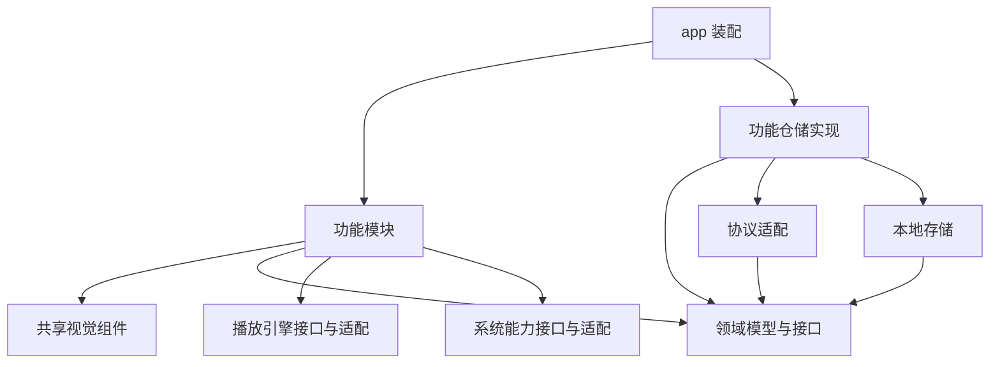

# ReelNest 项目结构与模块设计

日期：2026-10-03

状态：已确认的结构设计方向，随实现细化。2026-10-04 已初始化 `apps/client`、五端平台工程、基础应用外壳和 CI 配置。下文仍是完整目标布局，尚未建立独立 packages、数据与播放模块；实际范围见[开发指南](DEVELOPMENT.zh-CN.md)。

## 1. 设计原则

- 一个仓库、一个 Flutter 应用，共享 Windows、macOS、iOS、Android、Ubuntu 的主要界面与业务代码。
- 按功能组织代码，让同一功能的页面、状态和数据协调逻辑放在相邻位置。
- 将界面、业务规则、协议、存储、播放引擎和系统能力分开，避免重新形成巨大的全局 AppState 或播放器视图。
- 保留原 macOS 版的外观和主要交互；桌面与手机按屏幕空间和输入方式适配布局。
- 先在应用内部建立边界，形成稳定职责后再提取独立包，不提前创建大量空目录。
- 旧 MediaLib 保留在原仓库作为实现参考和兼容服务端来源，不整体复制到新仓库。

## 2. 目标目录

```text
reelnest/
├── README.md
├── apps/
│   └── client/
│       ├── lib/
│       │   ├── main.dart
│       │   ├── app/
│       │   │   ├── bootstrap.dart       # 初始化、启动顺序
│       │   │   ├── router.dart          # 路由与导航入口
│       │   │   └── dependencies.dart    # 依赖装配、实现选择
│       │   ├── shell/
│       │   │   ├── desktop_shell.dart   # 侧栏、标题栏、内容区
│       │   │   └── mobile_shell.dart    # 移动导航与内容区
│       │   ├── features/
│       │   │   ├── servers/             # 服务器、登录、账号切换
│       │   │   ├── home/                # 最近播放、推荐
│       │   │   ├── library/             # 媒体库、分类、筛选
│       │   │   ├── search/
│       │   │   ├── details/             # 电影、剧集等详情
│       │   │   ├── playback/            # 播放会话、队列、控制界面
│       │   │   ├── downloads/           # 下载、离线管理
│       │   │   └── settings/
│       │   └── platform/
│       │       ├── file_access/
│       │       ├── window/
│       │       ├── media_session/       # 系统媒体控制、锁屏信息
│       │       └── capabilities.dart
│       ├── assets/                      # 图片、字体、图标
│       ├── test/
│       ├── integration_test/
│       ├── windows/
│       ├── macos/
│       ├── linux/
│       ├── ios/
│       ├── android/
│       └── pubspec.yaml
├── packages/                            # 随边界稳定逐步提取
│   ├── reelnest_domain/
│   ├── reelnest_api/
│   ├── reelnest_storage/
│   ├── reelnest_player/
│   └── reelnest_ui/
├── contracts/
│   └── mlink-v1/                        # 契约与脱敏样例
├── docs/
│   ├── README.md
│   ├── PROJECT_STRUCTURE.zh-CN.md
│   ├── FLUTTER_IMPLEMENTATION_PLAN.zh-CN.md
│   ├── GITHUB_REPOSITORY_PLAN.zh-CN.md
│   ├── design/                          # 按需建立
│   └── decisions/                       # 按需建立
├── tooling/                             # 检查、构建、打包工具
└── .github/
    └── workflows/
```

五个平台目录保存原生入口、权限、构建与平台集成代码，不能当作可丢弃的缓存。Ubuntu 使用 Flutter 的 `linux/` 平台工程，不建立第二个 Ubuntu 应用。CI 和发布细节见[仓库规划](GITHUB_REPOSITORY_PLAN.zh-CN.md)。

## 3. 功能模块内部

以媒体库为例：

```text
features/library/
├── presentation/
│   ├── library_page.dart
│   └── widgets/                         # 本功能专用组件
├── application/
│   ├── library_controller.dart          # 加载、筛选、分页
│   └── library_state.dart
└── data/
    └── library_repository_impl.dart     # 接口与本地缓存的协调
```

- `presentation` 展示状态、接收操作，不直接执行 HTTP、SQL 或播放引擎命令。
- `application` 使用 Riverpod 组织状态和依赖，调用仓储或能力接口；负责加载、错误、取消与重试等行为。
- `data` 实现仓储接口，协调远程协议和存储，不包含 Widget。
- 跨功能的领域模型、仓储接口与规则属于 `reelnest_domain`；仅本功能使用的状态和规则留在功能内部。
- 简单功能不强制建立所有层，也不为每次方法调用增加一层转发类。

不同功能不能直接读取对方的 Controller 私有状态。通过路由参数、领域标识或明确的共享服务协作；共享播放会话可以由多个页面订阅，但由播放模块统一维护。

## 4. 独立包的职责与依赖

| 包 | 职责 | 约束 |
|---|---|---|
| `reelnest_domain` | 媒体模型、查询条件、业务规则、仓储接口 | 纯 Dart，不依赖 Flutter、HTTP、数据库或播放器插件 |
| `reelnest_api` | 鉴权请求、协议 DTO、响应解析、领域模型转换 | 可依赖 domain，不依赖页面、storage 或播放引擎 |
| `reelnest_storage` | Drift 表结构、查询、缓存、迁移 | 可依赖 domain，不直接调用远程 API |
| `reelnest_player` | 播放接口、事件、引擎适配与视频渲染适配 | 隔离 media_kit 类型，不处理服务器账号、队列策略或进度回传 |
| `reelnest_ui` | 色彩、字体、间距、通用视觉组件 | 不依赖 API、数据库和业务 Controller |

`app/dependencies.dart` 是装配入口，选择具体实现并注入功能模块。功能的仓储实现负责组合 API 与存储，两者不互相调用。播放器包需要展示视频时可以提供 Flutter 渲染适配，但不得因此让纯领域层依赖 Flutter。

依赖方向示意：



独立包只通过公开入口暴露必要类型，应用和其他包不导入其 `lib/src/` 内部实现。发现循环依赖时调整职责或抽出共同接口，不用全局变量绕过。

## 5. 外观保留与自适应布局

`reelnest_ui` 集中维护设计参数和共享组件，例如海报卡片、按钮、空状态和加载占位。业务实体先在页面侧转换为组件参数，避免通用组件自行查询数据。

`shell` 负责桌面侧栏、标题栏、手机导航以及可用宽度下的布局切换；依据窗口空间和交互能力适配，不单凭操作系统名称决定整个布局。页面负责内容，平台层负责实际窗口操作。

`docs/design/` 按需记录原版参考截图、交互说明和适配决定。运行时需要的字体、图片、图标放在 `apps/client/assets/`，不要让应用依赖文档目录。复用旧资源前确认其授权。

## 6. 播放业务与播放引擎

`reelnest_player` 封装打开媒体、播放、暂停、跳转、音轨与字幕切换，以及播放状态和错误事件。对外使用项目定义的请求、状态和事件类型；页面不能直接操作 media_kit 对象。

`features/playback` 管理当前媒体、播放队列、续播、下一集、进度回传和控制界面。服务端播放地址与鉴权由业务和协议层准备，播放引擎接收必要的地址与请求头，不自行登录服务端。

播放会话拥有引擎实例并负责释放；页面切换不应意外创建多个播放器。退出播放、切换服务器、退出账号时明确处理停止、进度保存和资源释放。高频进度只更新需要它的组件，避免整页重建。

未来替换某个平台的引擎时，保留上层播放接口。当前 media_kit 仍是待原型验证的优先实现，不能把计划当作五端播放能力已经验收。

## 7. 系统能力与协议边界

`platform/` 对外提供文件访问、窗口操作、系统媒体会话等能力接口，在内部选择插件或平台实现。原生桥接代码放在相应平台工程；平台判断尽量集中在这里和应用装配处。

能力状态要区分支持、不支持、未授权和暂时不可用。手机文件访问权限不等同于桌面目录权限，不能通过统一接口假装所有平台能力一致。凭据使用平台安全存储适配，不写入普通设置或日志。

Mlink DTO 在 API 边界转换成项目的领域对象，例如 `MediaItem`。页面不拼接服务器 URL，不依赖服务端字段命名。接口样例必须脱敏，并标记参考版本。

首期只实现已确认的 Mlink 闭环。Emby、Jellyfin 等作为未来按需求增加的适配器，不预先实现，也不把不同服务端的差异压成虚假的统一能力。

## 8. 测试、依赖与文件约定

- 功能测试放在应用的 `test/` 下，按功能对应组织；完整流程测试放在 `integration_test/`。
- 提取独立包时，把它负责的规则、解析、迁移或适配测试一起迁入包内；原生播放和设备能力仍需要对应平台验收。
- Dart 文件使用 `snake_case` 命名。功能专用组件就近存放，跨功能且职责明确的组件再提取共享。
- 不建立无限扩张的 `utils/` 或 `common/`；工具按实际职责归属。
- 单应用阶段提交应用的 `pubspec.lock`；进入多包阶段再启用根 Pub workspace，统一解析依赖和维护根锁文件。
- Flutter 版本在本地与 CI 保持一致；不提交构建缓存、签名密钥、真实用户数据和媒体文件。

## 9. 落地顺序

1. 建立 `apps/client`，准备五端平台工程及最小构建检查。
2. 在应用内建立 `app`、`shell`、功能目录和必要的平台能力接口；共享代码暂放在 `lib/domain`、`lib/api`、`lib/storage`、`lib/player`、`lib/ui` 中，按需创建。
3. 做通“连接服务器 → 登录 → 媒体库 → 详情 → 播放 → 进度回传”，同时验证五端关键播放能力。
4. 依据原 macOS 外观完善设计参数和共享组件，补齐桌面与移动布局。
5. 当模块需要独立依赖、独立测试或被多个功能稳定使用时，提取到 `packages/reelnest_*`，迁移引用与测试，并删除已迁出的旧实现。
6. 再按实施计划增加搜索、下载、本地媒体库等能力。

初始化已开始按上述顺序落地。后续结构变更同步更新本文；阶段与范围调整更新实施计划；CI、版本和发布规则更新仓库规划。
