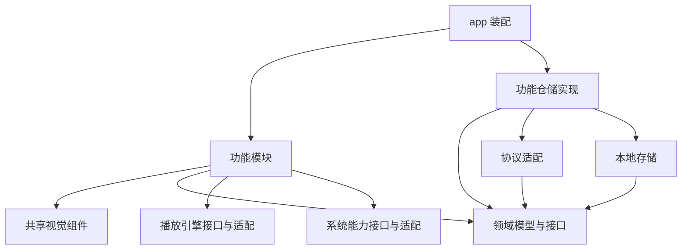

# ReelNest 项目结构与模块设计

2026-10-10 补充：Emby 画质规划与流式下载位于 `api/emby/emby_quality.dart` / `emby_download.dart`；图片及视频缓存清单、下载协调和清理保护位于 `features/sources/data/emby_cache_repository.dart`，UI 为 `emby_cache_actions.dart` 与设置中的 `video_cache_settings.dart`。播放会话仅获取/释放缓存租约，不直接下载或维护目录。实现范围见 [画质与缓存](EMBY_QUALITY_CACHE.zh-CN.md)。

更新：2026-10-09。正常入口为独立目录来源管理；用户确认本地媒体完成后优先接入 Emby。第一阶段仅 Windows/macOS/Linux，完整目标结构仍在逐步实现。

状态：已有 `apps/client`、平台工程、外壳、CI、文件来源/索引、本地基础播放及字幕/音轨面板、Emby E1 连接与选库、E2 同步/浏览及 E3 电影/剧集播放闭环。下文仍含目标布局；独立 packages、完整播放器和正式远程连接器尚未完成。实际范围见[本地媒体源与索引](LOCAL_SOURCES.zh-CN.md)、[播放与续播](LOCAL_PLAYBACK.zh-CN.md)、[字幕/音轨](PLAYER_TRACKS.zh-CN.md)。

## 1. 设计原则

用户确认的[项目边界](PROJECT_SCOPE.zh-CN.md)优先：只重构原项目，功能/UI/交互一致，不自行增删改功能。下文移动端目录及组件仅是已保留结构，不属于第一阶段开发任务。

- 一个仓库、一个 Flutter 应用；第一阶段只支持 Windows、macOS、Linux 三个桌面端。
- 按功能组织代码，让同一功能的页面、状态和数据协调逻辑放在相邻位置。
- 将界面、业务规则、协议、存储、播放引擎和系统能力分开，避免重新形成巨大的全局 AppState 或播放器视图。
- 功能、UI 和交互对照原 macOS 项目逐项迁移；不自行重新设计导航、表单或窄窗口布局。
- 先在应用内部建立边界，形成稳定职责后再提取独立包，不提前创建大量空目录。
- 旧 MediaLib 保留在原仓库作为功能与源码参考。ReelNest 自己管理索引和播放，直接访问文件来源及 Emby/Jellyfin/Plex，不依赖旧服务端。

## 2. 目标目录

### 当前实际布局与下一项连接器

当前只有 `apps/client` 一个 Flutter 包，依赖与锁文件在该目录维护；`packages/`、`contracts/` 尚未建立，不为计划中的模块预建空包。当前共享实现位于 `apps/client/lib`：

| 目录 | 当前职责 |
|---|---|
| `app/` | 启动、路由、应用装配；现有装配分布于 `service_providers.dart` 及各功能 provider，尚未统一到目标 `dependencies.dart` |
| `shell/` | 桌面侧栏和内容框架；移动 shell 模板保留但不推进 |
| `domain/` | 来源、媒体身份、索引、配置草稿、扫描事件等公共模型与规则 |
| `features/` | 按用户功能组织页面、状态协调与仓储：当前有来源、首页、设置，以及旧试验的媒体库/服务器模块 |
| `features/health/` | 本地健康规则、异步检测与缓存、忽略持久化、仪表盘本地监测区域及恢复设置；与文件扫描分开 |
| `sources/filesystem/` | 本地文件夹、移动盘、已挂载 NAS 的枚举、过滤、文件名解析及本地元数据 |
| `api/` | 纯协议请求与响应处理；已接入 `emby/` 登录/库协议；`mlink/` 为隔离保留的试验实现 |
| `features/playback/` | 视频会话、续播/轨道偏好、字幕发现/语言匹配、独立窗口与控制面板 |
| `player/` | 播放引擎接口、media_kit 原生适配与视频渲染，不处理服务器账号 |
| `storage/` | 当前 SQLite 表结构、存储接口；没有开发版本升级链 |
| `platform/` | 原生目录选择、安全凭据存储等系统适配 |
| `ui/` | 原版主题参数、矢量图标及公共组件 |

仓库顶层另有 `docs/`、`scripts/`、`.github/workflows/` 和 `.fvm/`。构建输出在应用 `build/` 下，不纳入源码；以下目标树中的 `tooling/` 暂以现有 `scripts/` 承担，不为名称统一单独搬动。

Emby 当前实现及后续模块：

- `lib/api/emby/`（E1 已实现）：地址、鉴权请求头、协议 DTO、响应解析、错误映射；不包含 Widget、SQL 或来源队列。
- `lib/sources/emby/`（E2 抓取/映射已实现）：将 Emby 对象转换为公共媒体模型，处理选库、同步、分页和播放资源准备；依赖协议客户端，不依赖页面。现有 `SourceAdapter.scan` 偏文件扫描，不能为复用接口强迫远程浏览模拟目录遍历；根据原调用链拆出必要能力接口。
- `lib/features/sources/`（E1–E3 已接入连接、同步、鉴权播放资源和上报）：原版 Emby 连接/选库表单与来源状态；`application/` 协调会话、同步和取消，`data/` 组合适配器与本地存储。凭据通过 `platform/` 的安全存储实现保存。
- `lib/features/library/`、目标 `details/` 和 `playback/`：承接公共浏览、详情与播放。当前本地浏览/详情暂在 `features/sources/presentation`，接入第二种真实来源时再按职责提取；旧 `features/library` 的 Mlink 实现不能直接作为公共媒体库接口。

两处 `sources` 职责不同：`features/sources` 管理用户操作媒体源的流程，顶层 `sources` 实现媒体从哪里来。页面不拼 Emby URL，播放器不处理 Emby 登录，缓存与会话按来源/账号隔离。新适配不经过旧 Mlink 试验；原版可选来源 ReelNest Server 后续独立迁移。

### 逐步形成的目标布局

```text
reelnest/
├── README.md
├── apps/
│   └── client/
│       ├── lib/
│       │   ├── main.dart
│       │   ├── app/
│       │   │   ├── bootstrap.dart       # 初始化、启动顺序
│       │   │   ├── router.dart          # 路由与导航入口
│       │   │   └── dependencies.dart    # 依赖装配、实现选择
│       │   ├── shell/
│       │   │   ├── desktop_shell.dart   # 侧栏、标题栏、内容区
│       │   │   └── mobile_shell.dart    # 移动导航与内容区
│       │   ├── features/
│       │   │   ├── sources/             # 多来源、目录授权、远程账号、可用性
│       │   │   ├── home/                # 最近播放、推荐
│       │   │   ├── library/             # 媒体库、分类、筛选
│       │   │   ├── search/
│       │   │   ├── details/             # 电影、剧集等详情
│       │   │   ├── playback/            # 播放会话、队列、控制界面
│       │   │   ├── downloads/           # 下载、离线管理
│       │   │   └── settings/
│       │   ├── sources/                # 来源适配器，通过领域接口使用
│       │   │   ├── filesystem/         # 本地目录、移动盘、已挂载 NAS 与扫描
│       │   │   ├── emby/
│       │   │   ├── jellyfin/
│       │   │   └── plex/
│       │   └── platform/
│       │       ├── file_access/
│       │       ├── window/
│       │       ├── media_session/       # 系统媒体控制、锁屏信息
│       │       └── capabilities.dart
│       ├── assets/                      # 图片、字体、图标
│       ├── test/
│       ├── integration_test/
│       ├── windows/
│       ├── macos/
│       ├── linux/
│       ├── ios/
│       ├── android/
│       └── pubspec.yaml
├── packages/                            # 随边界稳定逐步提取
│   ├── reelnest_domain/
│   ├── reelnest_api/
│   ├── reelnest_storage/
│   ├── reelnest_player/
│   └── reelnest_ui/
├── contracts/
│   ├── filesystem/                     # 扫描、离线、路径与元数据样例
│   ├── emby/                           # 各协议独立契约与脱敏样例
│   ├── jellyfin/
│   └── plex/
├── docs/
│   ├── README.md
│   ├── PROJECT_STRUCTURE.zh-CN.md
│   ├── FLUTTER_IMPLEMENTATION_PLAN.zh-CN.md
│   ├── GITHUB_REPOSITORY_PLAN.zh-CN.md
│   ├── design/                          # 按需建立
│   └── decisions/                       # 按需建立
├── tooling/                             # 检查、构建、打包工具
└── .github/
    └── workflows/
```

五个平台目录保存原生入口、权限、构建与平台集成代码，不能当作可丢弃的缓存。Ubuntu 使用 Flutter 的 `linux/` 平台工程，不建立第二个 Ubuntu 应用。CI 和发布细节见[仓库规划](GITHUB_REPOSITORY_PLAN.zh-CN.md)。

## 3. 功能模块内部

以媒体库为例：

```text
features/library/
├── presentation/
│   ├── library_page.dart
│   └── widgets/                         # 本功能专用组件
├── application/
│   ├── library_controller.dart          # 加载、筛选、分页
│   └── library_state.dart
└── data/
    └── library_repository_impl.dart     # 接口与本地缓存的协调
```

- `presentation` 展示状态、接收操作，不直接执行 HTTP、SQL 或播放引擎命令。
- `application` 使用 Riverpod 组织状态和依赖，调用仓储或能力接口；负责加载、错误、取消与重试等行为。
- `data` 实现仓储接口，协调远程协议和存储，不包含 Widget。
- 跨功能的领域模型、仓储接口与规则当前放在 `lib/domain`，未来提取为 `reelnest_domain`；仅本功能使用的状态和规则留在功能内部。
- 简单功能不强制建立所有层，也不为每次方法调用增加一层转发类。

不同功能不能直接读取对方的 Controller 私有状态。通过路由参数、领域标识或明确的共享服务协作；共享播放会话可以由多个页面订阅，但由播放模块统一维护。

## 4. 独立包的职责与依赖

| 包 | 职责 | 约束 |
|---|---|---|
| `reelnest_domain` | 媒体模型、查询条件、业务规则、仓储接口 | 纯 Dart，不依赖 Flutter、HTTP、数据库或播放器插件 |
| `reelnest_api` | 鉴权请求、协议 DTO、响应解析、领域模型转换 | 可依赖 domain，不依赖页面、storage 或播放引擎 |
| `reelnest_storage` | Drift 当前表结构、查询、缓存 | 可依赖 domain，不直接调用远程 API；开发阶段不维护历史升级链 |
| `reelnest_player` | 播放接口、事件、引擎适配与视频渲染适配 | 隔离 media_kit 类型，不处理服务器账号、队列策略或进度回传 |
| `reelnest_ui` | 色彩、字体、间距、通用视觉组件 | 不依赖 API、数据库和业务 Controller |

`app/dependencies.dart` 是装配入口，选择具体实现并注入功能模块。功能的仓储实现负责组合 API 与存储，两者不互相调用。播放器包需要展示视频时可以提供 Flutter 渲染适配，但不得因此让纯领域层依赖 Flutter。

依赖方向示意：



独立包只通过公开入口暴露必要类型，应用和其他包不导入其 `lib/src/` 内部实现。发现循环依赖时调整职责或抽出共同接口，不用全局变量绕过。

## 5. 外观保留与自适应布局

`reelnest_ui` 集中维护设计参数和共享组件，例如海报卡片、按钮、空状态和加载占位。业务实体先在页面侧转换为组件参数，避免通用组件自行查询数据。

`shell` 当前负责桌面侧栏、标题栏与内容区域，按原版窗口规则适配可用空间；桌面窄窗口不切换为手机底部导航。移动导航留待后续阶段。页面负责内容，平台层负责实际窗口操作。

`docs/design/` 按需记录原版参考截图、交互说明和适配决定。运行时需要的字体、图片、图标放在 `apps/client/assets/`，不要让应用依赖文档目录。复用旧资源前确认其授权。

## 6. 播放业务与播放引擎

`reelnest_player` 封装打开媒体、播放、暂停、跳转、音轨与字幕切换，以及播放状态和错误事件。对外使用项目定义的请求、状态和事件类型；页面不能直接操作 media_kit 对象。

`features/playback` 管理当前媒体、播放队列、续播、下一集和控制界面。来源适配器准备本地路径/授权 URI 或远程播放地址与鉴权；引擎只接收播放资源。本地进度保存在应用库，远程写回依来源能力和同步设置执行，播放器不自行登录服务器。

播放会话拥有引擎实例并负责释放；页面切换不应意外创建多个播放器。退出播放、切换服务器、退出账号时明确处理停止、进度保存和资源释放。高频进度只更新需要它的组件，避免整页重建。

未来替换某个平台的引擎时，保留上层播放接口。media_kit/libmpv 已验证 Windows 基础解码和本批字幕/音轨流程，macOS/Linux 原生及移动端能力仍未验收。

## 7. 系统能力与协议边界

`platform/` 对外提供文件访问、窗口操作、系统媒体会话等能力接口，在内部选择插件或平台实现。原生桥接代码放在相应平台工程；平台判断尽量集中在这里和应用装配处。

能力状态要区分支持、不支持、未授权和暂时不可用。手机文件访问权限不等同于桌面目录权限，不能通过统一接口假装所有平台能力一致。凭据使用平台安全存储适配，不写入普通设置或日志。

各协议 DTO 在来源适配器边界转换成项目领域对象。文件扫描结果也转换成相同的媒体身份与展示模型。页面不拼接服务器 URL、不依赖协议字段或全局登录会话；能力差异显式表示。接口样例必须脱敏并标记版本。

本地文件夹、移动硬盘、已挂载 NAS、Emby、Jellyfin、Plex 均为核心范围。前三类共享文件来源实现；后三类分别适配协议。每个来源有稳定 sourceId，缓存、条目与播放记录按来源/账号隔离。一个来源离线不阻断其他来源。原 `features/servers` 和 `api/mlink` 为待解耦的试验实现，不是目标结构；Mlink 不作为必需来源继续扩展。

## 8. 测试、依赖与文件约定

- 功能测试放在应用的 `test/` 下，按功能对应组织；完整流程测试放在 `integration_test/`。
- 提取独立包时，把它负责的规则、解析、迁移或适配测试一起迁入包内；原生播放和设备能力仍需要对应平台验收。
- Dart 文件使用 `snake_case` 命名。功能专用组件就近存放，跨功能且职责明确的组件再提取共享。
- 不建立无限扩张的 `utils/` 或 `common/`；工具按实际职责归属。
- 单应用阶段提交应用的 `pubspec.lock`；进入多包阶段再启用根 Pub workspace，统一解析依赖和维护根锁文件。
- Flutter 版本在本地与 CI 保持一致；不提交构建缓存、签名密钥、真实用户数据和媒体文件。

## 9. 落地顺序

1. 建立 `apps/client`，保留五端模板；当前只推进 Windows/macOS/Linux 工程与构建检查。
2. 在应用内建立 `app`、`shell`、功能目录和必要的平台能力接口；共享代码暂放在 `lib/domain`、`lib/api`、`lib/storage`、`lib/player`、`lib/ui` 中，按需创建。
3. 建立来源模型与路由仓储，先做通“选择目录 → 扫描索引 → 浏览详情 → 本地播放 → 保存进度”，覆盖三个桌面端的文件授权与播放能力。
4. 完善本地来源（含移动盘与已挂载 NAS）的离线恢复；本地媒体完成后优先实现 Emby，再推进 Jellyfin、Plex。每个模块同时对照原版功能与 UI，最终只做统一验收和修正。
5. 当模块需要独立依赖、独立测试或被多个功能稳定使用时，提取到 `packages/reelnest_*`，迁移引用与测试，并删除已迁出的旧实现。
6. 按原功能清单补齐搜索、下载等模块和平台行为；本地媒体库是早期主线，尚未全部完成。历史数据导入不因出现在早期规划中而自动成为当前开发任务，需有实际需求再设计。

初始化已开始按上述顺序落地。后续结构变更同步更新本文；阶段与范围调整更新实施计划；CI、版本和发布规则更新仓库规划。

## 本轮落地补充：播放队列（2026-10-09）

`features/playback/domain/video_queue.dart` 管理队列和结束动作，`PlaybackSession` 负责切换/EOF/保存协调。`data/playback_repository.dart` 批量读取列表观看状态并事务保存进度/更新时间；`player_preferences_repository.dart` 保存全局结束选项。`presentation/player_track_popovers.dart` 复用列表/弹层组件，`player_behavior_settings.dart` 按原更多设置框架迁移播放结束行，窗口操作仍由 `PlayerWindowApp` 承担。`media_activity` 为当前模块独立表，不建立历史版本升级链。边界见 [队列说明](PLAYER_QUEUE.zh-CN.md)。

Emby E1 的按来源凭据隔离、SQLite 非敏感配置及恢复规则见 [连接与选库说明](EMBY_CONNECTION.zh-CN.md)。没有新增历史数据库升级链。

E2 新增 `sources/emby` 的同步器/映射器、连接协议分页/图片方法，以及来源索引仓储的远程快照事务。按来源隔离的 `remote_media_metadata` 表存无凭据媒体字段；SQL 不存鉴权 URL。现有来源浏览/详情共用布局，后续统一组件命名不改变原 UI。详见 [E2 同步说明](EMBY_SYNC.zh-CN.md)。

E3 实际装配：播放资源准备与凭据刷新由 `EmbyConnectionRepository` 组合协议层承担，`PlaybackSession` 按来源分派并复用现有引擎/记录；不为目录规划单独增加空仓储或 Dart package。详见 [E3](EMBY_PLAYBACK.zh-CN.md)。


### Emby 状态操作与字幕补充

- `api/emby/emby_subtitle.dart` 保存内存中的服务器字幕描述，`emby_client.dart` 实现当前账号的收藏/已看端点及有界字幕读取。
- `features/sources/data/emby_connection_repository.dart` 按来源串行处理鉴权和状态写回；收藏失败回滚，观看批量失败保留本地并返回失败数。
- `features/playback/data/playback_repository.dart` 维护手动观看状态的事务；来源仓库维护本地收藏与同步策略。
- `features/sources/presentation/emby_media_actions.dart` 为详情/季集提供喜欢、单项和分页批量已看入口。
- `PlaybackSession` 管理字幕选择、取消和所属临时目录的生命周期；播放器面板显示服务器字幕，mpv 引擎继续统一处理字幕轨道。

详见 [本批范围与验证](EMBY_ACTIONS_SUBTITLES.zh-CN.md)。这些入口没有替代完整详情、导航或原版 UI 验收。

### Emby 服务器详情

- `api/emby/emby_detail.dart`：白名单展示字段、演职员和技术信息模型，不保留服务器资源 URL。
- `features/sources/data/emby_detail_repository.dart`：按来源隔离的 30 天 SQLite 详情缓存、失败保留、排队超时/取消和人物作品查询。
- `features/sources/application/emby_providers.dart`：缓存优先的详情流与鉴权图片数据生命周期。
- `features/sources/presentation/emby_detail_extras.dart`：折叠详情、人员入口、艺术照浏览和链接；公共详情页展示元信息/技术参数。
- `platform/external_links.dart`：三桌面端系统浏览器入口，可注入替身验证链接操作。

当前初始表 `remote_media_details` 与媒体索引建立复合外键，随条目删除；没有历史数据库迁移。字段/缓存规则与未迁移差异见 [详情记录](EMBY_DETAILS.zh-CN.md)。

### Emby 视频导航与浏览

`features/sources/domain/emby_library.dart` 保存来源/目的地模型和纯筛选/排序，`data/emby_library_repository.dart` 联合读取本机索引、观看记录和详情缓存，并保存想看和浏览状态。`application/emby_library_providers.dart` 负责变更刷新与大库 isolate；`presentation/emby_sidebar.dart` 和 `emby_video_library_page.dart` 承载来源树及分库页面，路由只传来源/库标识。同步仓储将 `remote_library_views` 和媒体快照一同事务提交；本地偏好随媒体级联删除。不增加空 Dart package、远程服务依赖或历史升级链。范围和一致性缺口见 [导航说明](EMBY_NAVIGATION.zh-CN.md)。
